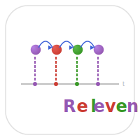

# Relevent.jl


[](https://github.com/statistical-network-analysis-with-Julia/Relevent.jl)
[](https://github.com/statistical-network-analysis-with-Julia/Relevent.jl/actions/workflows/CI.yml?query=branch%3Amain)
[](https://statistical-network-analysis-with-Julia.github.io/Relevent.jl/stable/)
[](https://statistical-network-analysis-with-Julia.github.io/Relevent.jl/dev/)
[](https://julialang.org/)
[](https://opensource.org/licenses/MIT)

<p align="center">
  
</p>

Additional Relational Event Model Features for Julia.

## Overview

Relevent.jl provides additional relational event model features complementing REM.jl, including ordinal timing models (Butts-Park Model), detailed interaction history tracking, and advanced REM statistics.

This package is a Julia port of the R `relevent` package from the StatNet collection.

## Installation

```julia
using Pkg
Pkg.add(url="https://github.com/statistical-network-analysis-with-Julia/Relevent.jl")
```

## Features

- **Interaction history**: Detailed tracking of event sequences
- **Advanced statistics**: Prior interaction, sending/receiving capacity, momentum
- **Ordinal BPM**: Model event ordering without exact timing
- **Timing models**: Parametric models for inter-event times

## Quick Start

```julia
using REM
using Relevent

# Track interaction history
history = InteractionHistory{Float64}()

for event in events
    update_history!(history, event)
end

# Query history
count = get_interaction_count(history, sender, receiver)
last_time = get_last_interaction(history, sender, receiver)

# Advanced statistics
stat = PriorInteraction(halflife=10.0; direction=:both)
```

## Interaction History

```julia
# Create history tracker
history = InteractionHistory{Float64}()

# Add events
for event in events
    update_history!(history, event)
end

# Query
get_interaction_count(history, i, j)  # Times i sent to j
get_last_interaction(history, i, j)   # Last time i sent to j

# Access internals
history.sender_history[i]    # All receivers of i (ordered)
history.receiver_history[j]  # All senders to j (ordered)
history.pair_history[(i,j)]  # All event times for dyad
history.event_counts[(i,j)]  # Count for dyad
```

## Advanced Statistics

### Prior Interaction
```julia
# Decayed count of prior interactions
PriorInteraction(halflife; direction=:outgoing)
PriorInteraction(halflife; direction=:incoming)
PriorInteraction(halflife; direction=:both)
```

### Capacity Statistics
```julia
# Sender's activity level
SendingCapacity(halflife)

# Receiver's popularity
ReceivingCapacity(halflife)
```

### Inertia and Momentum
```julia
# Tendency for repeat interactions (same dyad)
LocalInertia(halflife)

# Overall sender activity momentum
Momentum(halflife; normalize=false)
```

## Ordinal Butts-Park Model

When only event ordering is known (not exact times):

```julia
# Define statistics
stats = [
    LocalInertia(10.0),
    SendingCapacity(10.0)
]

# Fit ordinal model
result = fit_obpm(events, stats, n_actors)

# Access results
result.coefficients
result.std_errors
result.loglik
```

### Rank Events
```julia
# Convert events to ordinal ranks
ranks = rank_events(events)  # 1 = first event, 2 = second, etc.
```

## Timing Models

Model inter-event times with parametric hazard functions:

```julia
# Create timing model
model = TimingModel(statistics; baseline=:exponential)
model = TimingModel(statistics; baseline=:weibull)
model = TimingModel(statistics; baseline=:gompertz)

# Fit model
result = fit_timing(events, statistics, n_actors)

# Hazard and survival
h = hazard_rate(model, coef, baseline_params, t, x)
S = survival_function(model, coef, baseline_params, t, x)
```

### Baseline Hazards

- **Exponential**: Constant hazard `h(t) = λ`
- **Weibull**: `h(t) = (k/λ)(t/λ)^(k-1)` - increasing or decreasing hazard
- **Gompertz**: `h(t) = a·exp(b·t)` - exponentially increasing hazard

## Cumulative Network State

Track decaying network state:

```julia
# Create state tracker with decay
state = CumulativeState{Float64}(n_actors; halflife=10.0)

# Update with events
for event in events
    update_state!(state, event)
end

# Query state
get_outdegree_history(state, actor)
get_indegree_history(state, actor)
state.adj_matrix  # Decayed adjacency
```

## Example: Email Communication

```julia
# Load email events
events = load_email_events()
n_actors = 100

# Track history
history = InteractionHistory{Float64}()
for e in events
    update_history!(history, e)
end

# Statistics capturing communication patterns
stats = [
    LocalInertia(24.0),          # Repeat emails (24-hour halflife)
    PriorInteraction(168.0),     # Prior contact (1-week halflife)
    SendingCapacity(24.0),       # Active senders
    ReceivingCapacity(24.0),     # Popular receivers
]

# Fit REM
result = fit_rem(EventSequence(events, n_actors), stats)

# Positive LocalInertia → tendency to reply to same person
# Positive PriorInteraction → prior contact increases future contact
```

## Example: Ordinal Data

```julia
# Survey data: "Who did you interact with today?"
# Order known, but not exact times

events = [Event(1, 2, 1.0), Event(2, 3, 2.0), ...]  # Pseudo-times from order

result = fit_obpm(events, stats, n_actors)
```

## Documentation

For more detailed documentation, see:

- [Stable Documentation](https://statistical-network-analysis-with-Julia.github.io/Relevent.jl/stable/)
- [Development Documentation](https://statistical-network-analysis-with-Julia.github.io/Relevent.jl/dev/)

## References

1. Butts, C.T. (2008). A relational event framework for social action. *Sociological Methodology*, 38(1), 155-200.

2. Butts, C.T., Marcum, C.S. (2017). A relational event approach to modeling behavioral dynamics. In *Group Processes* (pp. 51-92). Springer.

3. Perry, P.O., Wolfe, P.J. (2013). Point process modelling for directed interaction networks. *Journal of the Royal Statistical Society: Series B*, 75(5), 821-849.

## License

MIT License - see [LICENSE](LICENSE) for details.
