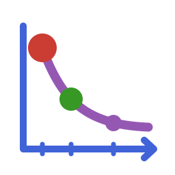

# Relevent.jl


[](https://github.com/statistical-network-analysis-with-Julia/Relevent.jl)
[](https://github.com/statistical-network-analysis-with-Julia/Relevent.jl/actions/workflows/CI.yml?query=branch%3Amain)
[](https://statistical-network-analysis-with-Julia.github.io/Relevent.jl/stable/)
[](https://statistical-network-analysis-with-Julia.github.io/Relevent.jl/dev/)
[](https://julialang.org/)
[](https://opensource.org/licenses/MIT)

<p align="center">
  
</p>

Additional Relational Event Model Features for Julia.

## Overview

Relevent.jl provides additional relational event model features complementing REM.jl, including ordinal timing models (Butts-Park Model), detailed interaction history tracking, and advanced REM statistics.

This package is a Julia port of the R `relevent` package from the StatNet collection.

## Installation

Requires Julia 1.12+. Relevent.jl depends on the unregistered
[Networks.jl](https://github.com/statistical-network-analysis-with-Julia/Networks.jl), [NetworkDynamic.jl](https://github.com/statistical-network-analysis-with-Julia/NetworkDynamic.jl), and [REM.jl](https://github.com/statistical-network-analysis-with-Julia/REM.jl) packages, which must be added first (in this order):

```julia
using Pkg
Pkg.add(url="https://github.com/statistical-network-analysis-with-Julia/Networks.jl")
Pkg.add(url="https://github.com/statistical-network-analysis-with-Julia/NetworkDynamic.jl")
Pkg.add(url="https://github.com/statistical-network-analysis-with-Julia/REM.jl")
Pkg.add(url="https://github.com/statistical-network-analysis-with-Julia/Relevent.jl")
```

For development, you can instead clone all ecosystem repositories side by
side (the monorepo layout) and start Julia with the root workspace project
(`julia --project=.` in the clone root): the `[sources]` path dependencies
then wire the packages together with no ordered installs needed.

## Features

- **Interaction history**: Detailed tracking of event sequences
- **Advanced statistics**: Prior interaction, sending/receiving capacity, momentum — computed via streaming accumulators (each event is absorbed once; no per-evaluation rescans of the event history)
- **Participation shifts**: The 13 Gibson (2003) `PSAB-BA`-family effects (`PShift`)
- **Covariate effects**: `CovSnd`, `CovRec`, `CovInt` as in R relevent
- **Ordinal BPM**: Model event ordering without exact timing (`fit_obpm`)
- **Timing models**: Parametric models for inter-event times (`fit_timing`, with a `t0` observation-onset keyword for left-truncated windows)
- **Standardized entry point**: `fit_relevent` (alias `rem_dyad`), dispatching between the ordinal and interval likelihoods via `ordinal=true/false` exactly like `relevent::rem.dyad`

## Quick Start

<!-- skip-check -->
```julia
using REM
using Relevent

# Track interaction history
history = InteractionHistory{Float64}()

for event in events
    update_history!(history, event)
end

# Query history
count = get_interaction_count(history, sender, receiver)
last_time = get_last_interaction(history, sender, receiver)

# Advanced statistics
stat = PriorInteraction(halflife=10.0; direction=:both)
```

## Interaction History

<!-- skip-check -->
```julia
# Create history tracker
history = InteractionHistory{Float64}()

# Add events
for event in events
    update_history!(history, event)
end

# Query
get_interaction_count(history, i, j)  # Times i sent to j
get_last_interaction(history, i, j)   # Last time i sent to j

# Access internals
history.sender_history[i]    # All receivers of i (ordered)
history.receiver_history[j]  # All senders to j (ordered)
history.pair_history[(i,j)]  # All event times for dyad
history.event_counts[(i,j)]  # Count for dyad
```

## Advanced Statistics

The examples below share a small simulated event stream:

```julia
using REM, Relevent, Random

rng = Xoshiro(1)
events = [Event(rand(rng, 1:6), rand(rng, 1:6), Float64(t)) for t in 1:80]
events = filter(e -> e.sender != e.receiver, events)
n_actors = 6
```

### Prior Interaction
```julia
# Decayed count of prior interactions (halflife = 10 time units)
PriorInteraction(10.0; direction=:outgoing)
PriorInteraction(10.0; direction=:incoming)
PriorInteraction(10.0; direction=:both)
```

### Capacity Statistics
```julia
# Sender's activity level
SendingCapacity(10.0)

# Receiver's popularity
ReceivingCapacity(10.0)
```

### Inertia and Momentum
```julia
# Tendency for repeat interactions (same dyad)
LocalInertia(10.0)

# Overall sender activity momentum
Momentum(10.0; normalize=false)
```

All history statistics decay with a half-life parameterization
(`decay = log(2)/halflife`) and are maintained by streaming accumulators:
each event is absorbed into the state once, and decayed values are
computed lazily on read, so evaluation cost does not grow with the length
of the event history.

### Participation Shifts

The 13 Gibson (2003) participation-shift indicators, named as in R
relevent (`PSAB-BA`, `PSAB-BY`, ...):

```julia
using Relevent

PShift(:AB_BA)      # turn receiving: B answers A
PShift("PSAB-XY")   # turn usurping: an outsider addresses another outsider
pshift_types()      # all 13 shift symbols
```

In shift names, `A`/`B` are the previous event's sender/receiver, `X`/`Y`
are any other actors, and `0` is the null actor (group-directed events are
encoded with `receiver == 0`).

### Covariate Effects

Actor-covariate effects as in R relevent, indexed by actor ID:

```julia
z = randn(10)     # one value per actor

CovSnd(z)         # sender covariate: statistic for i→j is z[i]
CovRec(z)         # receiver covariate: z[j]
CovInt(z)         # interaction covariate: z[i] + z[j]
```

## Standardized Entry Point

`fit_relevent` is the package's `fit_<model>` entry point (the ecosystem
convention alongside `REM.fit_rem`, `ERGM.fit_ergm`, `Siena.fit_siena`,
...); `rem_dyad` is the R-faithful alias:

<!-- skip-check -->
```julia
# Ordinal likelihood (default, as in relevent::rem.dyad)
result = fit_relevent(events, [PShift(:AB_BA), CovSnd(z)], n_actors)

# Interval-timing likelihood using the observed waiting times
result = fit_relevent(events, stats, n_actors; ordinal=false, t0=0.0)

rem_dyad(events, stats, n_actors)   # identical to fit_relevent
```

## Ordinal Butts-Park Model

When only event ordering is known (not exact times):

```julia
# Define statistics
stats = [
    LocalInertia(10.0),
    SendingCapacity(10.0)
]

# Fit ordinal model
result = fit_obpm(events, stats, n_actors)

# Access results
result.coefficients
result.std_errors
result.loglik
```

### Rank Events
```julia
# Convert events to ordinal ranks
ranks = rank_events(events)  # 1 = first event, 2 = second, etc.
```

## Timing Models

Model inter-event times with parametric hazard functions:

```julia
# Create timing model
model = TimingModel(stats; baseline=:exponential)
model_w = TimingModel(stats; baseline=:weibull)
model_g = TimingModel(stats; baseline=:gompertz)

# Fit model (exponential baseline; Weibull/Gompertz raise an informative
# error from fit_timing but work with hazard_rate/survival_function)
timing = fit_timing(events, stats, n_actors)

# Observation onset: for a left-truncated window (the process was already
# running when recording started), pass the window start as t0 so the
# first waiting time Δt₁ = t₁ − t0 is not overstated. Default t0 = 0,
# matching R relevent's "event times relative to onset of observation".
timing = fit_timing(events, stats, n_actors; t0=0.5)

# Hazard and survival for a dyad with statistic vector x at time t
x = zeros(length(stats))
h = hazard_rate(model, timing.coefficients, timing.baseline_params, 1.0, x)
S = survival_function(model, timing.coefficients, timing.baseline_params, 1.0, x)
```

### Baseline Hazards

- **Exponential**: Constant hazard `h(t) = λ`
- **Weibull**: `h(t) = (k/λ)(t/λ)^(k-1)` - increasing or decreasing hazard
- **Gompertz**: `h(t) = a·exp(b·t)` - exponentially increasing hazard

## Cumulative Network State

Track decaying network state:

```julia
# Create state tracker with decay
state = CumulativeState{Float64}(n_actors; halflife=10.0)

# Update with events
for event in events
    update_state!(state, event)
end

# Query state
get_outdegree_history(state, 1)   # decayed out-degree of actor 1
get_indegree_history(state, 1)    # decayed in-degree of actor 1
state.adj_matrix  # Decayed adjacency
```

## Example: Email Communication

<!-- skip-check -->
```julia
# Load email events (your own loader; REM.load_events reads DataFrames/CSV)
events = load_email_events()
n_actors = 100

# Track history
history = InteractionHistory{Float64}()
for e in events
    update_history!(history, e)
end

# Statistics capturing communication patterns
stats = [
    LocalInertia(24.0),          # Repeat emails (24-hour halflife)
    PriorInteraction(168.0),     # Prior contact (1-week halflife)
    SendingCapacity(24.0),       # Active senders
    ReceivingCapacity(24.0),     # Popular receivers
]

# Fit REM
result = fit_rem(EventSequence(events, n_actors), stats)

# Positive LocalInertia → tendency to reply to same person
# Positive PriorInteraction → prior contact increases future contact
```

## Example: Ordinal Data

<!-- skip-check -->
```julia
# Survey data: "Who did you interact with today?"
# Order known, but not exact times

events = [Event(1, 2, 1.0), Event(2, 3, 2.0), ...]  # Pseudo-times from order

result = fit_obpm(events, stats, n_actors)
```

## Documentation

For more detailed documentation, see:

- [Stable Documentation](https://statistical-network-analysis-with-Julia.github.io/Relevent.jl/stable/)
- [Development Documentation](https://statistical-network-analysis-with-Julia.github.io/Relevent.jl/dev/)

## References

1. Butts, C.T. (2008). A relational event framework for social action. *Sociological Methodology*, 38(1), 155-200.

2. Butts, C.T., Marcum, C.S. (2017). A relational event approach to modeling behavioral dynamics. In *Group Processes* (pp. 51-92). Springer.

3. Perry, P.O., Wolfe, P.J. (2013). Point process modelling for directed interaction networks. *Journal of the Royal Statistical Society: Series B*, 75(5), 821-849.

## License

MIT License - see [LICENSE](LICENSE) for details.
